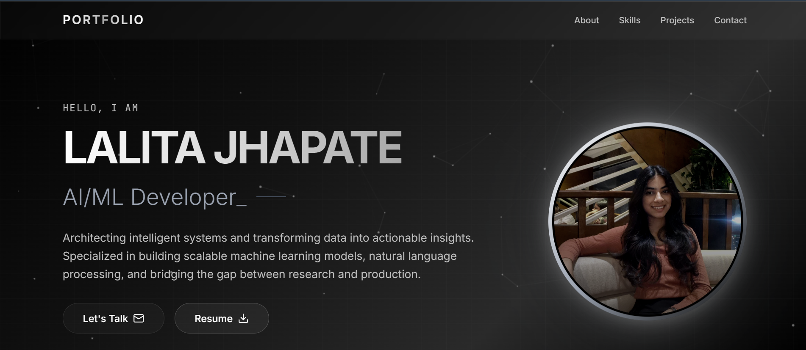

# Personal Portfolio




A modern and responsive portfolio website showcasing my AI/ML projects, technical skills, certifications, and development journey.

## Live Demo

🔗 **Portfolio Website:** "#"

## About

This portfolio highlights my work in Artificial Intelligence, Machine Learning, and Software Development. It serves as a central place to showcase projects, certifications, technical skills, and professional achievements.

## Features

* Responsive design for all devices
* Modern black, white, and silver theme
* Interactive project showcase
* Skills and technology section
* Certification gallery with PDF access
* Resume download
* Contact and social links
* Smooth animations and modern UI

## Tech Stack

* React
* TypeScript
* Vite
* Tailwind CSS
* Framer Motion

## Featured Projects

* CareerPilot AI
* GreenLoop
* AI GitHub PR Reviewer
* Gardening Chatbot
* Car Evaluation Model

## Installation

```bash
git clone <repository-url>
cd portfolio
npm install
npm run dev
```

## Build for Production

```bash
npm run build
```

## Contact

* LinkedIn: https://www.linkedin.com/in/lalita-jhapate-61b899353
* GitHub: https://github.com/Lalita0008
* Kaggle: https://www.kaggle.com/lalitajhapate
* Email: [lalitajhapate043@gmail.com](mailto:lalitajhapate043@gmail.com)

## License

This project is open source and available under the MIT License.
